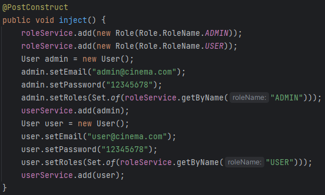
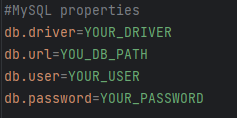

# :movie_camera: Cinema-app :movie_camera:

Welcome to my Simple Spring Web App!

This web application is part of my ongoing course project to demonstrate my progress and learning with the 
Spring framework, specifically focusing on Spring Security. The app only covers 
the backend functionality and offers an excellent opportunity to showcase the foundations of Spring framework and 
its powerful security features.

Main Features:

* Shopping Cart: Experience the backend logic that allows users to add, remove, and modify their shopping carts for movie tickets.
* Ticket Booking: Get a glimpse of the ticket booking functionality, where users can reserve movie tickets.
* Movie Session Availability: Explore the backend code to check the availability of movie sessions.

Please note that this app is a learning project and not intended as a fully completed product. It serves as a demonstration of my skills and understanding of Spring framework's capabilities, particularly in handling security aspects.

## :building_construction: Project structure

* **_Controller layer_**: Managing the endpoints, processing HTTP requests and response to it
* **_Service layer_**: Performs main business logic and is an intermediary between Controller and Data layers
* **_Data layer_**: It responsible for performing database operations

## :floppy_disk: Database structure

## :link: Endpoints and permissions

| **HTTP method** | **Endpoint**                   |   **Role** |                                  **Function** |
|:----------------|:-------------------------------|-----------:|----------------------------------------------:|
| POST            | /register                      |        ALL |                                 register user |
| POST            | /cinema-halls                  |      ADMIN |                         add cinema hall to DB |
| POST            | /movies                        |      ADMIN |                               add movie to DB |
| POST            | /movie-sessions                |      ADMIN |                       add movie session to DB | 
| POST            | /orders/complete               |       USER |                                complete order |
| GET             | /cinema-halls                  | ADMIN/USER |                         show all cinema halls |
| GET             | /movies                        | ADMIN/USER |                               show all movies |
| GET             | /movie-sessions/available      | ADMIN/USER | show available movie session for certain date |
| GET             | /users/by-email                |      ADMIN |                       show user info by email |
| GET             | /orders                        |       USER |      show order history by authenticated user |
| GET             | /shopping-carts/by-user        |       USER |      show shopping cart by authenticated user |
| DELETE          | /movie-sessions                |      ADMIN |                          remove movie session |
| PUT             | /shopping-carts/movie-sessions |       USER |            add movie session to shopping cart |

## :electron: Technologies used

* _**JDK 17**_
* _**Maven**_
  * Checkstyle plugin 3.1.1
  * Compiler plugin 3.10.1
  * War plugin 3.3.2
* _**Spring**_ 
  * Core 5.3.20
  * Web MVC 5.3.20
* _**Spring Security 5.6.10**_
* _**Hibernate 5.6.14.Final**_
* _**MySql 8.0.33**_
* _**TomCat 9.0.50**_

## :rocket: Launch instruction

1. Install Intellij Idea
2. Install MySQL 8
3. Install Tomcat 9.0.**
4. Forking and the cloning project to your machine
5. Update rows in cinema-app/src/main/resources/db.properties (extended explanation 2)
6. Open Idea and add Tomcat plugin
7. Build the project with "mvn clean package" command in terminal
8. Configure and run your local server with the Tomcat plugin
9. Check the functionality with HTTP requests (extended explanation 3)

### :bulb: Extended explanation
1. You can test the functionality of the application by using prepared users in "DataInitializer.class"

2. Completely fill out all the upper case rows in db_properties file 

3. You can use simple and powerful instrument for sending HTTP request - [POSTMAN](https://www.postman.com/)

### :warning: Limitation
* Do not change the Spring and Spring security version cos of there are some old versions of used classes that changed in Spring 6+ versions
* Do not install the Tomcat 10+ version cos of some conflicting dependencies
